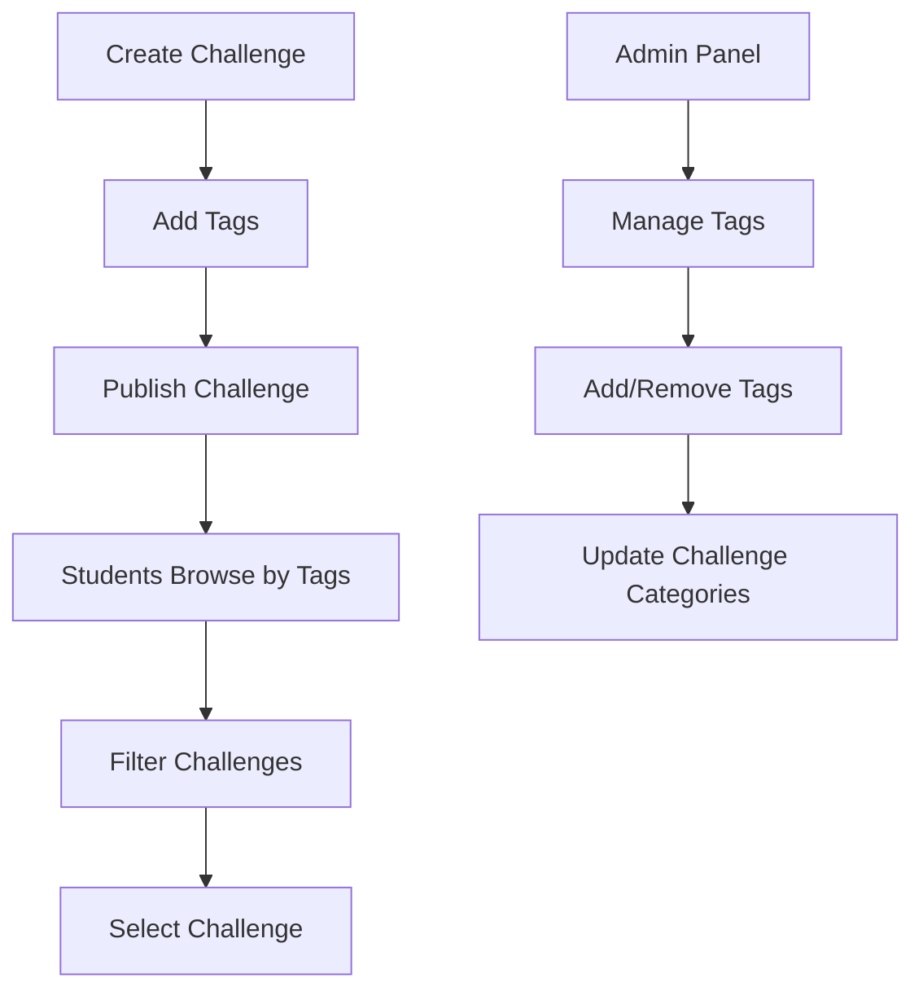

# Challenge Tags API Endpoints

## 🏷️ Gestión de Tags para Challenges

Se han agregado endpoints completos para gestionar tags en los challenges, permitiendo organizar y categorizar los desafíos de programación.

## 📋 Endpoints Disponibles

### 1. **Obtener Todos los Tags**
```http
GET /api/v1/challenges/tags
```

**Descripción**: Obtiene todos los tags disponibles en el sistema.

**Response**:
```json
[
  {
    "id": "123e4567-e89b-12d3-a456-426614174000",
    "name": "Algorithm",
    "color": "#FF5733",
    "iconUrl": "https://example.com/algorithm-icon.png"
  },
  {
    "id": "987fcdeb-51a2-4567-8901-abcdef123456",
    "name": "Data Structure",
    "color": "#33FF57",
    "iconUrl": "https://example.com/ds-icon.png"
  }
]
```

### 2. **Agregar Tag a un Challenge**
```http
POST /api/v1/challenges/{challengeId}/tags
```

**Descripción**: Agrega un nuevo tag a un challenge específico.

**Request Body**:
```json
{
  "name": "Algorithm",
  "color": "#FF5733",
  "iconUrl": "https://example.com/icon.png"
}
```

**Response** (201 Created):
```json
{
  "id": "456789ab-cdef-1234-5678-90abcdef1234",
  "name": "Algorithm",
  "color": "#FF5733",
  "iconUrl": "https://example.com/icon.png"
}
```

**Errores**:
- `404 Not Found`: Challenge no encontrado

### 3. **Obtener Tags de un Challenge**
```http
GET /api/v1/challenges/{challengeId}/tags
```

**Descripción**: Obtiene todos los tags asociados a un challenge específico.

**Response**:
```json
[
  {
    "id": "123e4567-e89b-12d3-a456-426614174000",
    "name": "Algorithm",
    "color": "#FF5733",
    "iconUrl": "https://example.com/algorithm-icon.png"
  },
  {
    "id": "789abcde-f012-3456-7890-123456789abc",
    "name": "Beginner",
    "color": "#28a745",
    "iconUrl": "https://example.com/beginner-icon.png"
  }
]
```

**Errores**:
- `404 Not Found`: Challenge no encontrado
- `400 Bad Request`: ID de challenge inválido

### 4. **Remover Tag de un Challenge**
```http
DELETE /api/v1/challenges/{challengeId}/tags/{tagId}
```

**Descripción**: Remueve un tag específico de un challenge.

**Response**: `204 No Content`

**Errores**:
- `404 Not Found`: Challenge o tag no encontrado

## 🎨 **Estructura del Tag**

### ChallengeTag Entity
```java
@Entity
@Table(name = "challenge_tags")
public class ChallengeTag {
    @EmbeddedId
    private ChallengeTagId id;
    
    @Column(nullable = false)
    private String name;
    
    private String color;        // Hex color code
    
    private String iconUrl;      // URL to tag icon
    
    @ManyToOne(fetch = FetchType.LAZY)
    @JoinColumn(name = "challenge_id", nullable = false)
    private Challenge challenge;
}
```

### Características
- **ID único**: Cada tag tiene un UUID único
- **Name**: Nombre descriptivo del tag
- **Color**: Código hexadecimal para representación visual
- **Icon URL**: URL opcional para ícono del tag
- **Relación bidireccional** con Challenge

## 🔧 **Funcionalidades de Negocio**

### 1. **Gestión en Challenge Aggregate**
```java
public class Challenge {
    @OneToMany(mappedBy = "challenge", cascade = CascadeType.ALL, orphanRemoval = true)
    private List<ChallengeTag> tags = new ArrayList<>();
    
    // Business methods
    public void addTag(ChallengeTag tag) {
        this.tags.add(tag);
        tag.setChallenge(this);
    }
    
    public void removeTag(ChallengeTag tag) {
        this.tags.remove(tag);
    }
}
```

### 2. **Commands Domain**
- **AddChallengeTagCommand**: Para agregar tags
- **RemoveChallengeTagCommand**: Para remover tags
- **GetAllChallengesTagsQuery**: Para obtener todos los tags

### 3. **Validaciones**
- Challenge debe existir antes de agregar/remover tags
- Tag debe existir en el challenge para ser removido
- Name es obligatorio al crear un tag
- Color debe ser formato hexadecimal válido

## 📊 **Casos de Uso**

### 1. **Categorización de Challenges**
```bash
# Agregar tag de dificultad
POST /api/v1/challenges/123e4567.../tags
{
  "name": "Beginner",
  "color": "#28a745",
  "iconUrl": "https://example.com/beginner.png"
}

# Agregar tag de tema
POST /api/v1/challenges/123e4567.../tags
{
  "name": "Dynamic Programming",
  "color": "#6f42c1",
  "iconUrl": "https://example.com/dp.png"
}
```

### 2. **Filtrado y Búsqueda**
```bash
# Obtener todos los tags disponibles para filtros
GET /api/v1/challenges/tags

# Obtener tags específicos de un challenge
GET /api/v1/challenges/123e4567.../tags
```

### 3. **Gestión de Tags**
```bash
# Remover tag obsoleto
DELETE /api/v1/challenges/123e4567.../tags/789abcde...
```

## 🎯 **Ejemplos de Tags Comunes**

### Por Dificultad
- **Beginner**: `#28a745` (Verde)
- **Intermediate**: `#ffc107` (Amarillo)
- **Advanced**: `#dc3545` (Rojo)
- **Expert**: `#6f42c1` (Púrpura)

### Por Tema
- **Algorithm**: `#ff5733` (Naranja)
- **Data Structure**: `#33ff57` (Verde Lima)
- **Dynamic Programming**: `#3357ff` (Azul)
- **Graph Theory**: `#ff33f5` (Magenta)
- **Math**: `#33fff5` (Cyan)

### Por Lenguaje
- **Java**: `#f89820` (Naranja Java)
- **Python**: `#3776ab` (Azul Python)
- **JavaScript**: `#f7df1e` (Amarillo JS)
- **C++**: `#00599c` (Azul C++)

## 🚀 **Beneficios**

1. **Organización**: Categorizar challenges por dificultad, tema, lenguaje
2. **Filtrado**: Permitir búsqueda y filtrado eficiente de challenges
3. **UX Mejorada**: Representación visual con colores e íconos
4. **Flexibilidad**: Tags personalizables por challenge
5. **Escalabilidad**: Sistema extensible para nuevas categorías

## 🔄 **Flujo de Integración**



---

**Los endpoints de Challenge Tags están listos para usar!** 🎉 Permite categorización completa y filtrado inteligente de challenges.